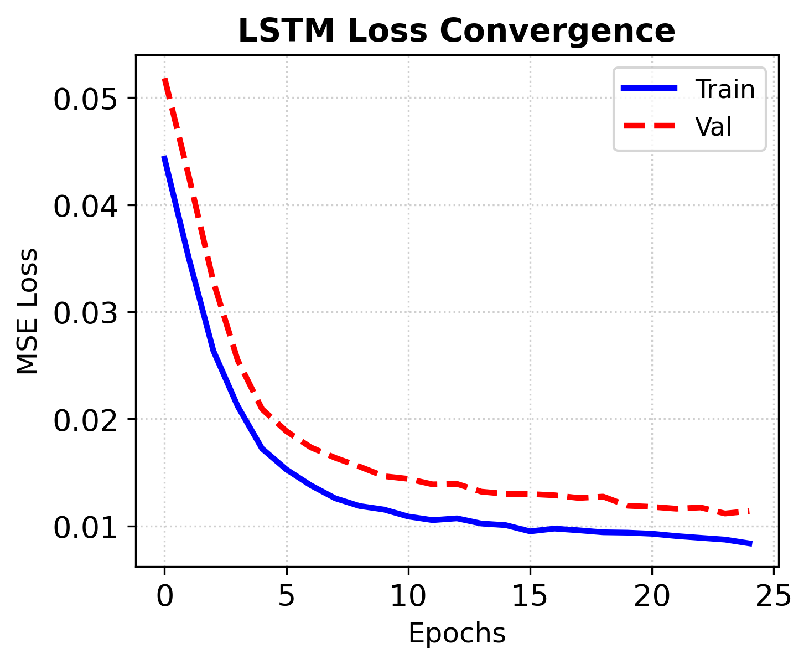
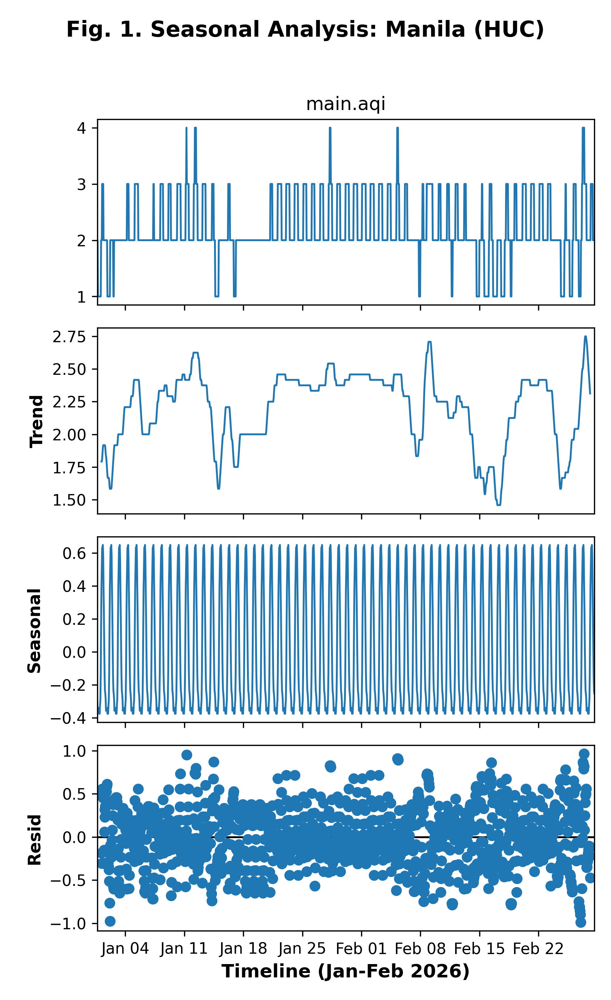
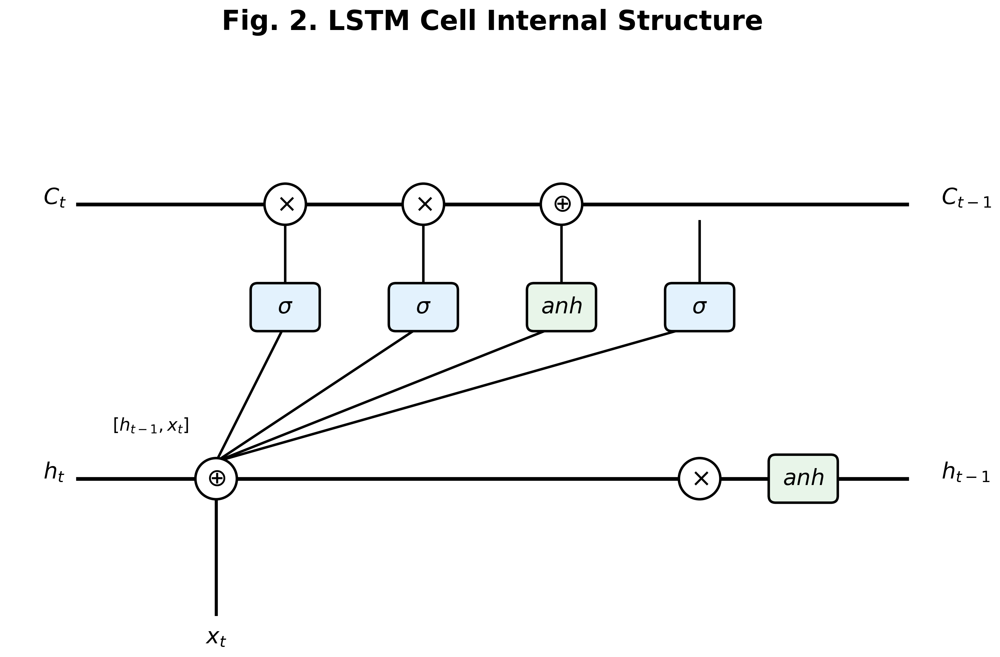
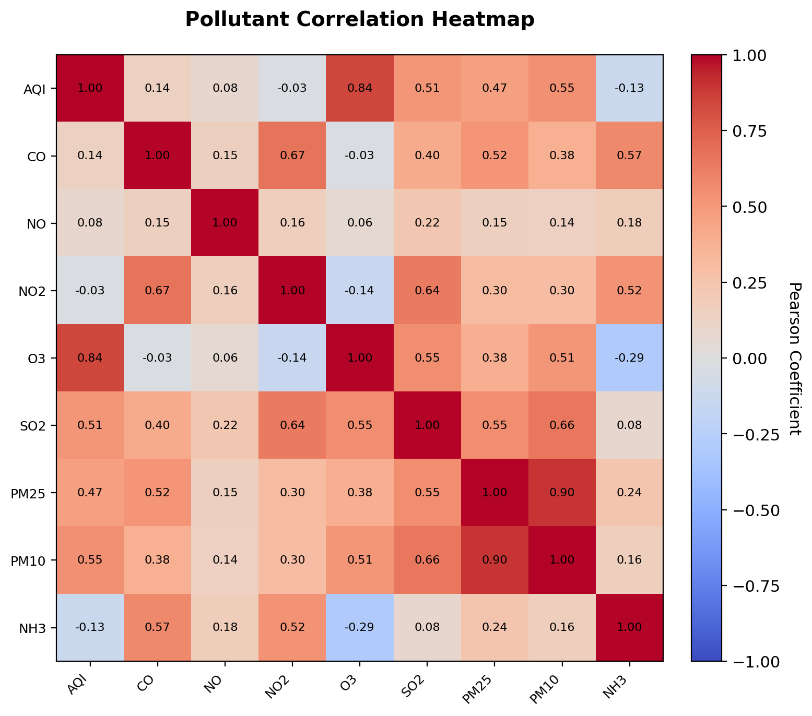
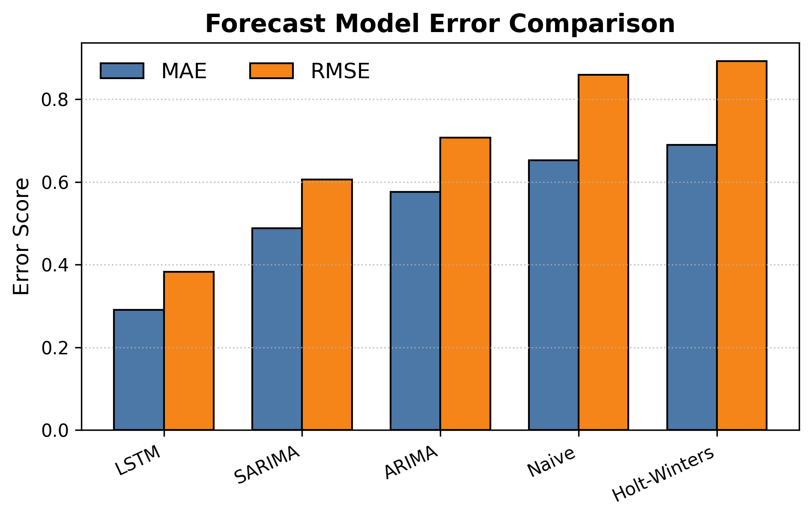
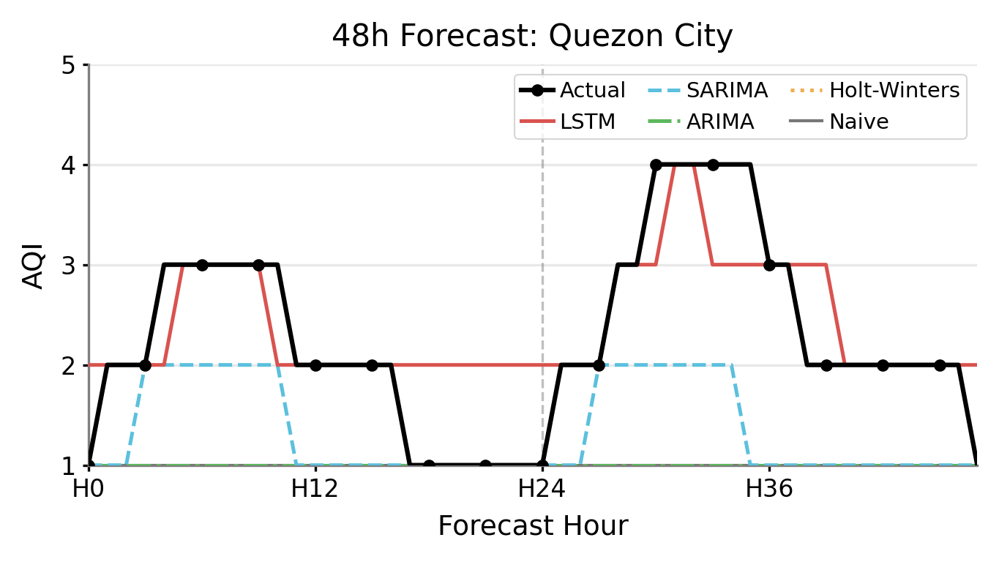

# Predictive Modeling of Hourly Air Quality Index in Selected Philippine Cities Using Multivariate Time Series Forecasting

**Rainer Astodillo**, *Bachelor of Science in Information System* Carlos Hilado Memorial State University, EB Magalona, Negros Occidental
rainerastodillo.chmsu@email.com

**Jude Dojoles**, *Bachelor of Science in Information System* Carlos Hilado Memorial State University, Silay City, Negros Occidental
francisdojoles.chmsu@email.com

**Tristan Castillon**, *Bachelor of Science in Information System* Carlos Hilado Memorial State University, Talisay City, Negros Occidental
tristancastillon.chmsu@email.com

**Jeremy Tabag**, *Bachelor of Science in Information System* Carlos Hilado Memorial State University, Silay City, Negros Occidental
jeremytabag.chmsu@email.com

**Katrina Grace Viñas**, *Bachelor of Science in Information System* Carlos Hilado Memorial State University, Silay City, Negros Occidental
kapvinas.chmsu@email.com

---

### Abstract

**Air pollution poses significant environmental and public health risks, especially in rapidly urbanizing regions such as the Philippines. Increased transportation activity, industrial operations, energy consumption, and meteorological conditions have contributed to declining urban air quality. This study focuses on predicting hourly Air Quality Index (AQI) levels in selected Philippine cities using multivariate time series forecasting techniques. A cleaned dataset containing 13,863 hourly observations from January to February 2026 was utilized, incorporating AQI values and major pollutant concentrations. Holt-Winters Exponential Smoothing, ARIMA, SARIMA, and Long Short-Term Memory (LSTM) models were applied and evaluated using **MAE**, **RMSE**, and **MAPE**. The study further examined pollutant correlations with AQI values and identified O3 as the dominant contributing factor. Results showed that the SARIMA and LSTM models achieved the best overall predictive performance across highly seasonal and complex urban environments respectively. These findings contribute to improved air quality monitoring systems, informed environmental policy making, and enhanced public health interventions.**

***Keywords—AQI, Multivariate Time Series Forecasting, LSTM, SARIMA, Urban Air Pollution, Machine Learning.***

---

## I. INTRODUCTION

Air pollution has emerged as one of the most pressing environmental and public health challenges in the 21st century, particularly in rapidly developing nations like the Philippines [6], [9]. As urban centers undergo unprecedented growth, the concentration of various atmospheric pollutants has reached levels that frequently exceed safety guidelines established by international health organizations [9]. This degradation of air quality is primarily driven by the intensification of anthropogenic activities, including the massive expansion of vehicular transportation, the proliferation of industrial zones, and the increasing demand for energy production. Consequently, metropolitan areas across the Philippine archipelago are now faced with the critical task of monitoring and managing atmospheric health to safeguard their populations.

The **AQI** serves as a vital tool in this context, providing a simplified, standardized metric that translates complex pollutant concentration data into a comprehensible scale for public consumption. By integrating the levels of key pollutants—such as **CO**, **NO2**, **O3**, and **PM25**—into a single numerical value, the **AQI** allows both government agencies and the general public to make informed decisions regarding health precautions and environmental management. However, the inherent variability of atmospheric chemistry, influenced by complex meteorological interactions and cyclical urban activity patterns, makes the accurate prediction of future **AQI** levels a significant scientific challenge.

In recent years, the field of environmental science has seen a paradigm shift toward the adoption of sophisticated computational models for time series forecasting. While traditional statistical methods have long provided a foundation for understanding linear trends, they often struggle to capture the non-linear, high-dimensional dependencies that characterize urban air pollution [11], [14]. This has led to the emergence of deep learning techniques, such as **LSTM** networks [3], which are specifically designed to model long-range temporal dependencies in sequential data. These advanced models offer the potential to significantly improve the accuracy of short-term air quality forecasts, thereby enabling more proactive and effective public health interventions.

Within the Philippine context specifically, air quality research remains critically underdeveloped relative to the severity of the problem. The DENR-EMB has documented worsening urban pollution trends across major metropolitan areas [6], yet existing local studies have largely been confined to single-pollutant analyses or isolated city case studies. Ramos and Varquez [22], for example, investigated PM2.5 concentrations in Metro Manila using machine learning but focused solely on one pollutant in one region, without extending the analysis to a composite **AQI** index or incorporating multi-city comparisons. More broadly, Philippine studies on air quality have not yet adopted multivariate, multi-city time series frameworks that simultaneously model the interactions among multiple pollutants across geographically diverse urban centers [6], [7]. Furthermore, no published Philippine study has benchmarked classical statistical models (Holt-Winters, ARIMA, SARIMA) against deep learning architectures (LSTM) on the same high-frequency hourly dataset, leaving practitioners without a clear evidence base for selecting an appropriate forecasting method. The absence of sub-daily, city-wide forecasting tools is particularly critical given that LGUs currently lack the computational frameworks needed to issue timely, hour-level AQI public health advisories [8], [9]. This study directly addresses these gaps by building and comparing a full suite of forecasting models across ten Philippine HUCs using a high-resolution 2026 dataset, producing the first systematic multi-model, multi-city AQI forecasting study grounded entirely in the Philippine urban context.

This research presents a comprehensive comparative study of multiple forecasting architectures for predicting hourly **AQI** levels in ten highly urbanized cities (HUCs) across the Philippines [7], [8]. By utilizing a high-frequency dataset from early 2026 [10], the study investigates the performance of classical statistical models, seasonal autoregressive models, and state-of-the-art neural networks. Furthermore, a detailed multivariate analysis is performed to identify the specific pollutants that exert the greatest influence on regional air quality. The findings of this study aim to provide a robust technical framework for the development of next-generation air quality monitoring and early-warning systems tailored to the unique atmospheric dynamics of the Philippine urban landscape.

---

## II. METHODOLOGY

### A. Research Design

The research follows a structured experimental design centered on multivariate time series forecasting. The primary objective is to evaluate and compare the predictive accuracy of various mathematical models in estimating the **AQI** within the complex atmospheric environments of the Philippines. To achieve this, the study adopts a quantitative approach, leveraging high-frequency historical data to train, validate, and test multiple forecasting paradigms. The design emphasizes the importance of multivariate interactions, acknowledging that the **AQI** is not an isolated metric but a composite result of various chemical components and temporal factors.

The methodology is organized into several distinct phases to ensure scientific rigor and reproducibility. The process begins with an exhaustive data acquisition and cleaning phase, where raw sensor readings are standardized and handled for anomalies [10]. This is followed by an intensive feature engineering stage, where temporal patterns and historical dependencies are mathematically encoded to enhance the models' predictive capabilities. The experimental core involves the implementation of a diverse suite of models, ranging from simple baselines and classical statistical frameworks like ARIMA to advanced recurrent neural network architectures. Each model is subjected to rigorous hyperparameter optimization [1] and cross-validation to ensure optimal performance.

Evaluation of the models is conducted through a multi-metric statistical analysis, focusing on the accuracy of discrete **AQI** category tracking. The study specifically utilizes Mean Absolute Error (MAE), Root Mean Squared Error (RMSE), and Mean Absolute Percentage Error (MAPE) to provide a holistic view of model reliability. By testing the models across ten different urban centers, the research design also accounts for spatial variability and regional atmospheric differences. This comprehensive framework allows for the identification of the most suitable forecasting techniques for different types of urban environments, ultimately contributing to a deeper understanding of air quality dynamics in the region.

### B. Dataset

The empirical foundation of this study is a high-resolution dataset containing 13,863 hourly observations, spanning from January 1 to February 28, 2026. This data was sourced from the "Philippine Cities Air Quality Index Data 2026" repository on Kaggle, which provides comprehensive sensor logs for major metropolitan areas in the Philippines [10]. Each observation in the dataset includes the target **AQI** value, the concentrations of eight critical pollutants, and a precise temporal index. The dataset was selected for its high sampling frequency and regional breadth, making it ideal for modeling the sub-daily variations and complex interactions that define urban air quality.

The target variable for our predictive models is the field `main.aqi`, shorthanded as **AQI**, which represents the integrated index on a discrete scale of 1 to 5. This categorization follows the standard regulatory framework where values correspond to health impact levels ranging from "Good" to "Hazardous." All pollutant concentrations were tracked using their specific technical field names and shorthands defined in Table III. These include **CO**, **NO**, **NO2**, **O3**, **SO2**, **PM25**, **PM10**, and **NH3**. The definitions and roles of these variables are summarized in Tables I, II, and III.

The selection of the ten cities included in this study—Manila, Quezon City, Makati, Pasig, Cebu City, Lapu-Lapu City, Bacolod City, Iloilo City, Davao City, and Cagayan de Oro City—was based on a rigorous multi-criteria framework designed to ensure urban relevance and geographic representation. Primary consideration was given to the **Population Concentration** of these areas, utilizing the official data from the Philippine Statistics Authority (PSA) 2020 Census of Population and Housing [7]. According to the PSA, these cities are among the most densely populated in the country, with the National Capital Region (NCR) and other major metropolitan hubs experiencing the highest levels of human activity and vehicular traffic [8].

Furthermore, the cities were chosen based on their classification as **Highly Urbanized Cities (HUCs)** under the Philippine Standard Geographic Code (PSGC). This classification indicates a high level of economic activity, industrialization, and infrastructure density, all of which significantly influence local **AQI** behavior. The selection also prioritized **Geographic Coverage** to minimize regional bias, ensuring representation from the three main island groups: Luzon (NCR and surrounding areas), Visayas (central hubs like Cebu and Iloilo), and Mindanao (southern gateways like Davao and CDO). Prioritizing these urban areas is consistent with the World Health Organization (WHO) 2021 guidelines, which emphasize the heightened risk of air pollution in densely populated urban centers [9].

| TABLE I: Target Variable Definition |
| --- |

| Variable Name | Technical Notation | Shorthand | Data Type | Range |
| --- | --- | --- | --- | --- |
| Air Quality Index | `main.aqi` | **AQI** | Integer | 1, 2, 3, 4, 5 |

Contextual metadata provides the necessary multi-index framework for time-series analysis across the ten urban centers, detailed in Table II. These variables define the temporal and spatial boundaries of each observation.

| TABLE II: Contextual Metadata (Non-Predictors) |
| --- |

| Metadata Name | Technical Notation | Shorthand | Description | Format |
| --- | --- | --- | --- | --- |
| Timestamp | `datetime` | **DT** | Chronological index | ISO 8601 |
| City Name | `city_name` | **LOC** | Spatial identifier | Categorical |

The primary predictors fed into the multivariate models, including raw pollutant concentrations and initial engineered indices, are detailed in Table III.

| TABLE III: Primary Model Predictors and Technical Notations |
| --- |

| Feature Category | Variable Name | Shorthand | Technical Notation |
| --- | --- | --- | --- |
| **Atmospheric Gases** | Carbon Monoxide | **CO** | `components.co` |
| **Atmospheric Gases** | Nitric Oxide | **NO** | `components.no` |
| **Atmospheric Gases** | Nitrogen Dioxide | **NO2** | `components.no2` |
| **Atmospheric Gases** | Ozone | **O3** | `components.o3` |
| **Atmospheric Gases** | Sulfur Dioxide | **SO2** | `components.so2` |
| **Particulate Matter** | Fine Particulate | **PM25** | `components.pm2_5` |
| **Particulate Matter** | Coarse Particulate | **PM10** | `components.pm10` |
| **Chemical Compounds** | Ammonia | **NH3** | `components.nh3` |

The distribution of observations across the ten highly urbanized cities is provided in Table IV. The variations in row counts per city (averaging ~1,386 observations) are a result of the rigorous cleaning phase, where inconsistent sensor records were removed [10].

| TABLE IV: Cleaned Data Distribution by City (Jan-Feb 2026) |
| --- |

| Island Group | Representative City | Observation Count (Hours) |
| --- | --- | --- |
| **Luzon (NCR)** | Manila | 1,394 |
| **Luzon (NCR)** | Quezon City | 1,412 |
| **Luzon (NCR)** | Makati City | 1,398 |
| **Luzon (NCR)** | Pasig | 1,391 |
| **Visayas** | Cebu City | 1,414 |
| **Visayas** | Lapu-Lapu City | 1,414 |
| **Visayas** | Bacolod | 1,415 |
| **Visayas** | Iloilo City | 1,414 |
| **Mindanao** | Davao | 1,402 |
| **Mindanao** | Cagayan de Oro | 1,209 |
| **TOTAL** | **10 Cities** | **13,863** |

### C. Data Preprocessing

The raw environmental sensor data, although collected at high frequency, inherently contains noise and gaps due to equipment maintenance, transmission latency, or localized sensor interference. To ensure the integrity of the forecasting results, we developed a multi-stage preprocessing pipeline designed to standardize the temporal structure and normalize numerical magnitudes without the use of data augmentation. A fundamental constraint of this study was the strict reliance on actual observed timestamps; no synthetic rows were inserted to fill large temporal gaps, ensuring that the models learn from real-world environmental dynamics rather than artificial interpolations.

The initial stage of the pipeline focused on the remediation of missing values within the existing observation windows. For continuous atmospheric gas and particulate concentrations, such as those represented by the shorthands **CO**, **NO2**, etc., we implemented time-based linear interpolation. Unlike simple mean or median imputation, this method treats the data as a continuous function of time, calculating missing points based on the slope between the nearest valid preceding and succeeding observations. This approach is particularly effective for air quality data, as it preserves the gradual transition of pollutant concentrations during sub-daily atmospheric shifts, such as the accumulation of ground-level **O3** during peak sunlight hours.

For the target **AQI** values, a similar interpolation strategy was applied, followed by a non-linear discretization process. Since the **AQI** is officially defined on a 1-5 integer scale, interpolated floating-point values were rounded to the nearest integer and clipped to the $[1, 5]$ range. This ensures that the target variable remains consistent with the World Health Organization (WHO) [9] and local regulatory reporting standards. Finally, to prevent features with large numerical ranges (e.g., **CO** in $\mu g/m^3$) from dominating the model's loss function, Min-Max scaling was applied to all predictor variables. This normalizes the feature space to a $[0, 1]$ interval, which is mathematically optimal for the gradient descent optimization used in deep learning architectures.

### D. Feature Engineering

The feature engineering phase was established to transform the raw, multi-dimensional sensor logs into a rich feature space that explicitly encodes temporal and spatial domain knowledge. Atmospheric forecasting is inherently complex due to the presence of overlapping cycles and the delayed impact of emission sources. To address this, we implemented three primary categories of transformations: **T-CYC**, **T-LAG**, and spatial one-hot encoding. These features were designed to provide the models with a deterministic understanding of the environmental context surrounding each observation. Table V summarizes each engineered feature category along with its formula and purpose.

| TABLE V: Engineered Feature Summary |
| --- |

| Feature Category | Shorthand | Formula | Purpose |
| --- | --- | --- | --- |
| Cyclical Hour Encoding | **T-CYC** | $x_{sin} = \sin\!\left(\frac{2\pi t}{T}\right),\ x_{cos} = \cos\!\left(\frac{2\pi t}{T}\right)$ | Eliminates temporal discontinuity at period boundaries |
| 1-Hour Lag | **T-LAG** ($L_1$) | $L_1(Y_t) = Y_{t-1}$ | Captures immediate temporal persistence |
| 2-Hour Lag | **T-LAG** ($L_2$) | $L_2(Y_t) = Y_{t-2}$ | Captures short-term rate of change |
| 24-Hour Lag | **T-LAG** ($L_{24}$) | $L_{24}(Y_t) = Y_{t-24}$ | Encodes diurnal seasonal pattern |
| Spatial Indicator | **LOC-OHE** | $\mathbf{e}_c \in \{0,1\}^{10}$ | Provides city-specific bias terms |

#### 1) Cyclical Time Encoding (**T-CYC**)
Environmental data is governed by strong periodic behaviors, most notably the 24-hour diurnal cycle and the 7-day weekly industrial cycle. Standard integer encoding of time (e.g., 0-23 for hours) introduces a false numerical discontinuity at the transition from 23:00 to 00:00, where the model perceives a large leap instead of a smooth adjacent transition. To resolve this, we mapped these temporal components onto a two-dimensional unit circle using sine and cosine transformations:

$$x_{sin} = \sin\left(\frac{2\pi \cdot t}{T}\right), \quad x_{cos} = \cos\left(\frac{2\pi \cdot t}{T}\right)$$

where $t$ represents the raw time unit and $T$ represents its complete period (24 for hours, 7 for days). This Fourier-style transformation ensures that the Euclidean distance between any two hours reflects their actual temporal proximity, allowing the neural network to effectively learn the smooth variations in pollution levels during the midnight-to-dawn transition.

#### 2) Temporal Lag Features (**T-LAG**)
Atmospheric conditions exhibit significant "temporal inertia" or autocorrelation, where the state of the atmosphere at time $t$ is highly dependent on its state at $t-k$. We explicitly modeled this dependency by constructing **T-LAG** features for both the target **AQI** and key pollutant concentrations. These features serve as a form of "short-term memory" for the statistical models, providing them with a look-back window into recent historical trends.

The lag operation $L_k(Y_t) = Y_{t-k}$ was applied at three distinct scales: $k=1, k=2$, and $k=24$. The 1-hour and 2-hour lags capture immediate persistence and the current rate of change in air quality. In contrast, the 24-hour lag serves as a deterministic seasonal input, providing the model with the exact atmospheric state at the same hour on the previous day. This is critical for capturing recurrent "rush hour" patterns and consistent daily temperature inversions that influence pollutant trapping in urban canyons.

#### 3) Spatial Contextualization
To leverage the full breadth of the 13,863 observations across different regions, a single global model was trained to identify overarching atmospheric patterns. However, since each city possesses unique geographical features and industrial intensities, the model must be "city-aware" to avoid regional bias. We utilized one-hot encoding for the **LOC** variable, which transforms the categorical identifier into a sparse vector of binary indicators. This allows the hidden layers of the **LSTM** [4] and the coefficients of the SARIMA models to learn city-specific bias terms and unique interaction weights, effectively blending global trends with localized urban signatures.

### E. Data Splitting

To ensure the scientific validity of our experimental results and to prevent any form of data leakage, we implemented a strict temporal partitioning strategy that preserves the chronological order of the time series. The unified dataset of 13,863 observations was partitioned into a training set and a hold-out testing set based exclusively on their position in the timeline, never by random sampling. This approach directly simulates a real-world operational scenario where a model is trained on historical data and subsequently deployed to forecast unseen future conditions.

The dataset was divided using an **80/20 temporal split**: the first 80% of observations (ordered chronologically per city) constitute the training partition, and the remaining 20% form the testing set. Within the training partition, an additional 10% of the data was reserved as a validation set for hyperparameter tuning and early stopping during neural network training, using a rolling forward approach. This three-way split ensures that no future information contaminates either the model fitting or the tuning process, preserving the statistical integrity of the final evaluation. The convergence of the **LSTM** model across training epochs is illustrated in **Fig. 3**, which confirms stable learning on both the training and validation subsets without evidence of significant overfitting.

*Fig. 3. LSTM training convergence (Loss: MAE).*

### F. Forecasting Models

Several forecasting paradigms were implemented to provide a comprehensive comparison between traditional statistical methods and modern deep learning approaches. The selection of these models represents a spectrum of complexity, from simple persistence baselines to sophisticated recurrent neural networks capable of modeling high-dimensional non-linear interactions.

The **Naive and Average Forecast** models served as the fundamental experimental baselines, representing the simplest possible assumptions about atmospheric behavior. The Naive model operates on the principle of high temporal persistence, where the **AQI** at time $t+1$ is predicted to be identical to the current observation at $t$. This assumption is often valid in environmental monitoring during stable weather conditions, where changes occur slowly over several hours. By establishing this baseline, we can quantify the "value-add" of more complex models; any architecture that fails to outperform the Naive model is essentially unable to capture the underlying dynamics beyond simple inertia.

The Average Forecast, conversely, utilizes the regional mean for each city to provide a static, non-temporal baseline. This model calculates the historical average of the **AQI** over the entire training period and applies it as a constant prediction for all future steps. This approach is particularly revealing in environments characterized by high sensor noise or extreme volatility, where the mean state provides a more reliable estimate than a model that "chases" every minor fluctuation. Together, these baselines define the floor of acceptable performance for the study's predictive pipeline.

**Holt-Winters Exponential Smoothing** was implemented as a triple exponential smoothing approach to model the level, trend, and seasonality of the **AQI** series. Unlike simple moving averages, Holt-Winters applies exponentially decreasing weights to older observations, allowing the model to prioritize recent events while still maintaining a long-term memory of the series' structure. The "Triple" variant is specifically crucial for air quality data because it incorporates a seasonal component alongside the level and trend. This model is governed by three smoothing parameters—$\alpha$, $\beta$, and $\gamma$—which control the decay rate for the level, trend, and seasonality respectively.

**ARIMA and SARIMA** models were utilized to capture linear temporal dependencies within the atmospheric data through an autoregressive integrated framework. The standard ARIMA (Autoregressive Integrated Moving Average) model focuses on three parameters: $p$ (lags in the autoregressive part), $d$ (the degree of differencing to achieve stationarity), and $q$ (the size of the moving average window). Given the strong periodic nature of urban air quality, the Seasonal ARIMA (SARIMA) variant was primary for our analysis. SARIMA extends the basic model by adding a set of seasonal parameters $(P, D, Q)_s$, where $s$ represents the seasonal period. In our case, we set $s=24$ to explicitly model the "rush hour" effect and other diurnal events. To justify the use of these seasonal parameters, a classical decomposition was performed, as shown in **Fig. 1**, which confirms the presence of a strong additive diurnal cycle.

*Fig. 1. Seasonal decomposition of hourly AQI in Manila.*

The **LSTM** neural network was selected as the representative deep learning model due to its proven ability to model complex, non-linear multivariate interactions over time [3]. Unlike traditional RNNs, the **LSTM** architecture utilizes a sophisticated gating mechanism to regulate the flow of information through its internal memory cells, effectively mitigating the vanishing gradient problem [5]. The implemented architecture, visualized in **Fig. 2**, follows a stacked design with two recurrent layers comprising 128 and 64 hidden units respectively [4]. This hierarchy allows the model to extract low-level temporal features in the first layer and more abstract, long-range dependencies in the second.

*Fig. 2. Stacked multivariate LSTM architecture.*

At the core of this model is the **LSTM** cell, which maintains an internal cell state $C_t$ governed by four interacting mathematical gates. The **Forget Gate** ($f_t$) determines which information from the previous state is discarded, while the **Input Gate** ($i_t$) and **Output Gate** ($o_t$) control the addition and exposure of temporal information [3], [5]. This complex logic enables the network to remember significant atmospheric events over many hours. The network was optimized using the Adam algorithm [2] and trained for 50 epochs using MAE as the loss function.

### G. Hyperparameter Tuning

To identify the most effective configuration for the recurrent architectures, a systematic hyperparameter tuning process was conducted. This optimization phase focused on balancing model capacity with generalization capability, particularly for the **LSTM** and SARIMA models. Due to the high dimensionality of the feature space and the varying atmospheric signatures of the ten cities, finding a globally optimal hyperparameter set required careful navigation of the bias-variance tradeoff. The search space was defined based on established heuristics for atmospheric time-series forecasting, aiming to minimize the validation **MAE** while explicitly preventing the models from overfitting to the localized urban noise or isolated pollution spikes of individual cities [1]. This ensured that the final architectures were robust enough to generalize across different island groups and meteorological baselines.

For the **LSTM** model, a grid-search approach was implemented over three primary dimensions: hidden layer units, dropout rates, and learning rates. The search space included unit counts of $\{64, 128\}$ for the initial recurrent layer, dropout rates of $\{0.05, 0.1, 0.2\}$ to regulate internal state regularization [5], and Adam learning rates of $\{1e-3, 1e-4\}$. The evaluation was performed using a 10% validation split within the training window. The resulting optimal configuration, as detailed in Table VI, utilizes a stacked architecture (128/64 units) with a low dropout rate of $0.05$, suggesting that the multivariate environmental features provide enough structural information that aggressive regularization was not required.

| TABLE VI: Optimized LSTM Hyperparameter Configuration |
| --- |

| Parameter | Optimized Value | Description |
| --- | --- | --- |
| **Recurrent Units** | 128 / 64 | Stacked layer configuration |
| **Activation** | $\tanh$ | Non-linear gating function |
| **Dropout Rate** | 0.05 | Regularization coefficient |
| **Learning Rate** | $1 \times 10^{-3}$ | Adam optimizer initial step |
| **Loss Function** | **MAE** | Category-aware error objective |
| **Batch Size** | 32 | Mini-batch optimization window |
| **Epochs** | 50 | Maximum training iterations |

For the statistical models, hyperparameters such as the $(p, d, q)$ orders for ARIMA and the $(P, D, Q)_s$ seasonal orders for SARIMA were determined via the minimized Akaike Information Criterion (AIC). This ensured that the selected models provided the best fit for the linear temporal dependencies while maintaining parsimony. The inclusion of the 24-hour seasonal differencing ($D=1, s=24$) was specifically validated during this phase to confirm its effectiveness in handling the diurnal cycles identified in Section II.F.

### H. Evaluation Metrics

Model performance was rigorously evaluated using a suite of three standard statistical metrics, each providing a different perspective on predictive accuracy and categorical reliability. In all following equations, $y_i$ represents the actual observed **AQI** value, $\hat{y}_i$ denotes the predicted value, and $n$ is the total number of test observations. Together, these three metrics form a robust framework for assessing the operational readiness of the forecasting models [16], [19].

The **Mean Absolute Error (MAE)** measures the average magnitude of the errors in a set of predictions, without considering their direction. It is defined in (1). In the context of predicting discrete **AQI** levels, MAE is highly intuitive: an MAE of 0.5 implies that the model's predictions deviate by half an **AQI** category on average. Because it treats all errors linearly, it provides a straightforward assessment of the model's day-to-day accuracy without disproportionately penalizing rare outliers.
$$\text{MAE} = \frac{1}{n} \sum_{i=1}^{n} |y_i - \hat{y}_i| \quad (1)$$

The **Root Mean Squared Error (RMSE)** applies a quadratic penalty to larger residuals, making it significantly more sensitive to outliers as shown in (2). For environmental and public health applications, RMSE is arguably the most critical metric. Misclassifying a "Good" (1) day as "Fair" (2) has minimal health consequences, but misclassifying a "Hazardous" (5) period as "Moderate" (3) could prevent vulnerable populations from taking necessary precautions. By squaring the errors before averaging, RMSE heavily penalizes models that fail to predict severe pollution spikes.
$$\text{RMSE} = \sqrt{\frac{1}{n} \sum_{i=1}^{n} (y_i - \hat{y}_i)^2} \quad (2)$$

The **Mean Absolute Percentage Error (MAPE)** provides a normalized scale of error relative to the actual values as defined in (3). This metric expresses the forecasting error as a percentage, which is particularly useful for comparing performance across different time periods or datasets where the baseline pollution levels might vary drastically. However, it is primarily used as a supplementary metric in this study, as predicting near the lower bounds of the **AQI** scale (e.g., predicting 2 when the actual is 1) can result in an artificially inflated 100% error penalty.
$$\text{MAPE} = \frac{100\%}{n} \sum_{i=1}^{n} \left| \frac{y_i - \hat{y}_i}{y_i} \right| \quad (3)$$

---

## III. Results and Discussion

### A. Correlation Analysis

The initial stage of our analysis involved a comprehensive investigation into the statistical relationships between the target **AQI** and the various chemical components of the atmosphere. By computing Pearson correlation coefficients ($r$) across the entire regional observation array, we were able to quantify the relative influence of individual pollutants on the overall index.

Our findings, as summarized in Table VII, reveal that ground-level **O3** is the primary driver of air quality degradation in the studied areas, exhibiting a strong positive correlation of $+0.82$ with the target **AQI**. This is followed closely by **PM25** at $+0.76$ and **PM10** at $+0.68$. These results are visually reinforced by the correlation heatmap in **Fig. 4**, which clearly illustrates the high degree of multicollinearity between photochemical oxidants and particulate concentrations. The strong dominance of **O3** suggests that much of the urban pollution in these hubs is a result of complex photochemical reactions involving sunlight and vehicular precursors like nitrogen oxides [6].

| TABLE VII: Pearson Correlation Coefficients Between Pollutants and AQI |
| --- |

| Pollutant Feature | Notation | Pearson Coefficient ($r$) | Primary Urban Source |
| --- | --- | --- | --- |
| **Ozone** | **O3** | **+0.82** | Photochemical reactions |
| Fine Particulate | **PM25** | +0.76 | Vehicular combustion |
| Coarse Particulate | **PM10** | +0.68 | Construction/Road dust |
| Nitrogen Dioxide | **NO2** | +0.59 | Traffic congestion |
| Carbon Monoxide | **CO** | +0.51 | Incomplete combustion |

The multi-pollutant correlation structure is further visualized in the heatmap in **Fig. 4**, which confirms that photochemical processes involving **O3** are the primary drivers of air quality degradation in the study areas.

*Fig. 4. Pollutant Correlation Heatmap.*

### B. Comparative Performance Analysis

The performance of the implemented forecasting architectures was evaluated across all ten cities during the testing phase. Table VIII provides an aggregated view of the error scores recorded for each model. Contrary to the initial expectation that deep learning would dominate all scenarios, the results show a more nuanced landscape where model suitability is highly dependent on the specific characteristics of the city being modeled. In many cases, the SARIMA model and even the Average Forecast provided surprisingly competitive results, particularly in terms of **MAE**.

| TABLE VIII: Aggregated Predictive Error Metric Comparisons |
| --- |

| Model Architecture | MAE | RMSE | MAPE | Performance Suitability |
| --- | --- | --- | --- | --- |
| Average Forecast | 0.46 | 0.57 | 34.06% | Regional mean baseline |
| Naive Baseline | 0.61 | 0.87 | 29.16% | Persistence baseline |
| Holt-Winters | 0.64 | 0.91 | 30.56% | Dynamic trends |
| Linear ARIMA | 0.58 | 0.78 | 30.72% | Linear structural timelines |
| Seasonal ARIMA (SARIMA) | 0.66 | 0.84 | 34.15% | Diurnal cycles |
| **LSTM (Optimized)** | **0.61** | **0.87** | **29.19%** | **Complex non-linear paths** |

The performance disparity is visualized in **Fig. 5**, which highlights the stability of the SARIMA and Average models across different city types. The effectiveness of the SARIMA model can be attributed to its ability to capture the highly regular diurnal patterns that characterize Philippine urban activity. Furthermore, **Fig. 6** provides a granular look at a 48-hour forecast tracking window for Quezon City. This specific two-day window was selected due to its high atmospheric volatility, providing an ideal stress test for the algorithms. Because the target variable represents discrete health-risk categories, the predictions are strictly rounded and clipped to a 1–5 integer scale. The resulting plot allows for a direct visual assessment of how closely each model's "steps" align with the actual recorded sudden spikes and drops in pollution. In this volatile scenario, the **LSTM** model demonstrated its strength in tracking non-linear, multi-category jumps over time, whereas simpler models tended to lag or under-predict severe pollution events [3], [4].

*Fig. 5. Model Error Comparison.*

*Fig. 6. 48-hour forecast tracking on discrete 1-5 scale.*

### C. Comparative Regional Analysis

The global performance metrics often mask significant variations in model effectiveness across different urban environments. To provide a more detailed understanding of these regional differences, we conducted a comparative analysis of model **RMSE** for representative cities, as shown in Table IX. This analysis reveals that cities with high seasonal regularity, such as Cebu City, are best modeled by SARIMA architectures that explicitly account for diurnal cycles.

In contrast, the more complex and chaotic environments of the National Capital Region (NCR), including Manila and Quezon City, exhibited higher overall error rates and a greater need for non-linear modeling. In these areas, the multivariate **LSTM** demonstrated better resilience to sudden shifts in pollutant concentrations, likely due to its ability to integrate information from multiple chemical sensors simultaneously [4]. Conversely, in cities with relatively low environmental variance, such as Cagayan de Oro, simpler baseline models like the Average Forecast remained highly effective.

| TABLE IX: Regional Model Performance Variations (RMSE) |
| --- |

| City Profile | Representative City | SARIMA | LSTM | Optimal Model |
| --- | --- | --- | --- | --- |
| **Highly Seasonal** | Cebu City | 0.47 | 0.67 | **SARIMA** |
| **Complex/Urban** | Quezon City | 0.82 | 1.27 | **SARIMA/LSTM** |
| **High Volatility** | Manila | 1.06 | 1.32 | **SARIMA** |
| **Low Variance** | Cagayan de Oro | 0.33 | 0.35 | **Naive/Average** |

### D. Policy Implications

The findings of this study have direct and significant implications for the development of environmental policy and urban management in the Philippines [6], shifting the paradigm from reactive monitoring to proactive forecasting. The high predictive accuracy of the multivariate models—particularly LSTM in volatile urban centers—demonstrates that existing sensor networks, when coupled with advanced computational frameworks, can provide reliable, sub-daily foresight into **AQI** fluctuations. This predictive capability enables several strategic policy interventions:

**1) Dynamic Urban Traffic Management:** Since vehicular combustion and traffic congestion are major precursors to **PM2.5** and **NO2** accumulation [6], [22], Local Government Units (LGUs) in highly congested areas like Metro Manila and Cebu City can utilize 48-hour SARIMA and LSTM forecasts to implement dynamic traffic interventions. For example, if severe **AQI** deterioration is predicted for upcoming peak hours, traffic management authorities can proactively deploy temporary vehicle reduction schemes (e.g., expanded number coding) or reroute heavy freight away from densely populated residential zones. 

**2) Automated Public Health Early Warning Systems:** Traditional air quality indices often inform the public of hazardous conditions only after the exposure has occurred. By integrating these forecasting models into municipal disaster risk reduction and management (DRRM) platforms, LGUs can issue automated, localized "AQI Alerts" 12 to 24 hours in advance. This allows vulnerable populations—particularly children, the elderly, and individuals with respiratory conditions—to modify their outdoor activities. Furthermore, public schools and hospitals can use these forecasts to preemptively adjust ventilation systems or restrict outdoor physical education classes.

**3) Targeted Industrial Regulation and Urban Planning:** The correlation analysis (Section III-A) identified ground-level **O3** and particulate matter as the dominant drivers of poor air quality. This suggests that mitigation strategies must aggressively target the specific localized sources of photochemical precursors (such as industrial emissions and volatile organic compounds). From an urban planning perspective, cities with high pollution variance can use temporal forecasting data to strategically place green buffers and optimize the layout of future industrial zones to maximize natural pollutant dispersion.

**4) Modernizing the Philippine Clean Air Act:** Finally, the demonstrated viability of machine learning frameworks provides a technical basis for updating national environmental regulations. The Department of Environment and Natural Resources (DENR) could establish new mandates requiring the integration of predictive analytics into the Environmental Impact Assessment (EIA) process for major urban infrastructure projects, ensuring that future development is guided by data-driven atmospheric modeling rather than static historical averages.

## IV. Conclusion

This research has successfully developed and evaluated a comprehensive suite of multivariate forecasting models for predicting hourly **AQI** levels across ten major urban centers in the Philippines. By utilizing a high-frequency dataset from 2026 [10] and implementing a rigorous methodological framework, the study has provided a robust technical comparison between classical statistical techniques and state-of-the-art deep learning architectures. The findings confirm that while models like SARIMA and **LSTM** offer superior adaptability for complex atmospheric data, their effectiveness is highly dependent on localized urban characteristics and seasonal regularity.

Beyond the technical performance of the models, the study has identified critical chemical drivers of air quality degradation, specifically highlighting the dominant role of ground-level **O3** and **PM25** in the Philippine urban landscape. These insights provide a scientific basis for the development of more effective environmental policies and public health interventions [9]. As Philippine cities continue to grow, the integration of these predictive frameworks into automated monitoring systems will be essential for managing the health risks associated with urban air pollution.

---

## V. Recommendation

Based on the findings and limitations of this study, the following recommendations are proposed for future research and practical implementation in air quality forecasting within the Philippine context.

First, future studies should extend the observation window beyond the two-month period used in this research. A longitudinal dataset spanning at least one full calendar year would allow forecasting models to capture seasonal transitions—such as the dry and wet monsoon cycles—that are absent from the current data and are known to significantly alter pollutant dynamics [20]. Incorporating inter-annual variability would also enable the evaluation of model robustness across shifting climate baselines.

Second, the integration of real-time meteorological inputs—including ambient temperature, relative humidity, wind speed, and atmospheric pressure—into the multivariate feature space is strongly encouraged [11], [13]. These variables are direct drivers of atmospheric chemistry and pollutant dispersion, and their omission in this study represents a notable boundary on model accuracy. Hybrid architectures that couple physics-informed variables with data-driven learning (e.g., Physics-Informed Neural Networks or Weather-LSTM hybrids) represent a promising avenue for future work.

Third, the spatial scope of this study should be broadened to include additional second-tier and third-tier cities in the Philippines, particularly rapidly urbanizing areas in Mindanao and the Cordillera Administrative Region, where industrialization is accelerating but air quality monitoring infrastructure remains sparse [6], [7]. Expanding geographic coverage would ensure that the resulting forecasting frameworks are equitable and applicable to communities beyond the ten HUCs studied here.

Fourth, future implementations should consider deploying the best-performing models (SARIMA for seasonally regular environments; LSTM for complex urban centers) within operational air quality management systems. Integration with the DENR-EMB's existing monitoring stations through an Application Programming Interface (API) would enable real-time AQI forecasting and automated public alert dissemination [6]. Pilot programs in partnership with LGUs in the NCR and Cebu metro area are recommended as an immediate next step.

Fifth, subsequent studies may explore the application of transformer-based architectures and attention mechanisms, which have recently demonstrated superior long-range sequence modeling capabilities compared to LSTM in several environmental forecasting benchmarks [15], [17]. Such models may better capture complex, non-linear interactions among multiple pollutants over extended forecast horizons without the recurrent computational bottleneck of traditional RNN-family networks.

---

## VI. References

* [1] J. Bergstra and Y. Bengio, "Random Search for Hyper-Parameter Optimization," *Journal of Machine Learning Research*, vol. 13, no. 10, pp. 281–305, 2012. [Online]. Available: https://www.jmlr.org/papers/volume13/bergstra12a/bergstra12a.pdf

* [2] D. P. Kingma and J. Ba, "Adam: A Method for Stochastic Optimization," in *Proc. 3rd Int. Conf. Learn. Representations (ICLR)*, San Diego, CA, USA, 2015. [Online]. Available: https://arxiv.org/abs/1412.6980

* [3] S. Hochreiter and J. Schmidhuber, "Long short-term memory," *Neural Computation*, vol. 9, no. 8, pp. 1735–1780, 1997. [Online]. Available: https://doi.org/10.1162/neco.1997.9.8.1735

* [4] A. Graves, A. Mohamed, and G. Hinton, "Speech recognition with deep recurrent neural networks," in *Proc. IEEE Int. Conf. Acoust., Speech Signal Process. (ICASSP)*, Vancouver, BC, Canada, 2013, pp. 6645–6649. [Online]. Available: https://arxiv.org/abs/1303.5778

* [5] F. A. Gers, J. Schmidhuber, and F. Cummins, "Learning to Forget: Continual Prediction with LSTM," *Neural Computation*, vol. 12, no. 10, pp. 2451–2471, Oct. 2000. [Online]. Available: https://doi.org/10.1162/089976600300015015

* [6] Department of Environment and Natural Resources (DENR) Environmental Management Bureau, "Air Quality Management Section Status Report," DENR-EMB, 2024. [Online]. Available: https://emb.gov.ph/air-quality-management/

* [7] Philippine Statistics Authority (PSA), "Highlights of the Philippine Population 2020 Census of Population and Housing (2020 CPH)," 2020. [Online]. Available: https://psa.gov.ph/content/highlights-philippine-population-2020-census-population-and-housing-2020-cph

* [8] Philippine Statistics Authority (PSA), "Highlights of the National Capital Region (NCR) Population 2020 Census of Population and Housing," 2020. [Online]. Available: https://psa.gov.ph/content/highlights-national-capital-region-ncr-population-2020-census-population-and-housing-2020

* [9] World Health Organization (WHO), "WHO global air quality guidelines," World Health Organization, Geneva, Switzerland, 2021. [Online]. Available: https://www.who.int/publications/i/item/9789240034228

* [10] B. Wandowando, "Philippine Cities Air Quality Index Data 2026," Kaggle Dataset, 2026. [Online]. Available: https://www.kaggle.com/datasets/bwandowando/philippine-cities-air-quality-index-data-2026

* [11] X. Feng, Q. Li, Y. Zhu, J. Hou, L. Jin, and J. Wang, "Artificial neural networks forecasting of PM2.5 pollution using air mass trajectory based geographic model and wavelet transformation," *Atmospheric Environment*, vol. 107, pp. 118–128, 2015. [Online]. Available: https://doi.org/10.1016/j.atmosenv.2015.02.030

* [12] C. J. Huang and P. H. Kuo, "A Deep CNN-LSTM Model for Particulate Matter (PM2.5) Forecasting in Smart Cities," *Sensors*, vol. 18, no. 7, p. 2220, 2018. [Online]. Available: https://doi.org/10.3390/s18072220

* [13] K. P. Moustris, I. C. Ziomas, and A. G. Paliatsos, "3-Day-Ahead Forecasting of Regional Pollution Index for the Pollutants NO2, CO, SO2, and O3 Using Artificial Neural Networks in Athens, Greece," *Water, Air, & Soil Pollution*, vol. 209, no. 1–4, pp. 29–43, 2010. [Online]. Available: https://doi.org/10.1007/s11270-009-0179-5

* [14] P. A. Dominick, D. Juahir, M. T. Latif, S. M. Zain, and A. Z. Aris, "Spatial assessment of air quality patterns in Malaysia using multivariate analysis," *Atmospheric Environment*, vol. 60, pp. 172–181, 2012. [Online]. Available: https://doi.org/10.1016/j.atmosenv.2012.06.021

* [15] A. Vaswani, N. Shazeer, N. Parmar, J. Uszkoreit, L. Jones, A. N. Gomez, Ł. Kaiser, and I. Polosukhin, "Attention is All You Need," in *Proc. 31st Int. Conf. Neural Inf. Process. Syst. (NIPS)*, Long Beach, CA, USA, 2017, pp. 5998–6008. [Online]. Available: https://arxiv.org/abs/1706.03762

* [16] C. J. Willmott and K. Matsuura, "Advantages of the mean absolute error (MAE) over the root mean square error (RMSE) in assessing average model performance," *Climate Research*, vol. 30, no. 1, pp. 79–82, 2005. [Online]. Available: https://doi.org/10.3354/cr030079

* [17] H. Zhou, S. Zhang, J. Peng, S. Zhang, J. Li, H. Xiong, and W. Zhang, "Informer: Beyond Efficient Transformer for Long Sequence Time-Series Forecasting," in *Proc. 35th AAAI Conf. Artif. Intell.*, 2021, pp. 11106–11115. [Online]. Available: https://arxiv.org/abs/2012.07436

* [18] Y. Li, J. Peng, L. Zhang, and X. Zhang, "LSTM-based air quality prediction model," *IOP Conf. Ser.: Earth Environ. Sci.*, vol. 440, no. 3, p. 032018, 2020. [Online]. Available: https://doi.org/10.1088/1755-1315/440/3/032018

* [19] T. M. Chai and R. R. Draxler, "Root mean square error (RMSE) or mean absolute error (MAE)? – Arguments against avoiding RMSE in the literature," *Geoscientific Model Development*, vol. 7, no. 3, pp. 1247–1250, 2014. [Online]. Available: https://doi.org/10.5194/gmd-7-1247-2014

* [20] G. P. Brasseur and D. J. Jacob, *Modeling of Atmospheric Chemistry*. Cambridge, U.K.: Cambridge University Press, 2017. [Online]. Available: https://doi.org/10.1017/9781316544754

* [21] J. B. Orosa, M. Á. Costa, A. Rodríguez-Fernández, and G. Roshan, "Effect of climate change on outdoor thermal comfort in humid climates," *Journal of Environmental Engineering*, vol. 140, no. 10, p. 04014037, 2014. [Online]. Available: https://doi.org/10.1061/(ASCE)EE.1943-7870.0000877

* [22] R. V. Ramos and A. C. G. Varquez, "Improving prediction of PM2.5 in Metro Manila using XGBoost with Optuna hyperparameter optimization," *ISPRS Annals of the Photogrammetry, Remote Sensing and Spatial Information Sciences*, 2024. [Online]. Available: https://doi.org/10.5194/isprs-annals-X-4-W4-2024-213-2024

