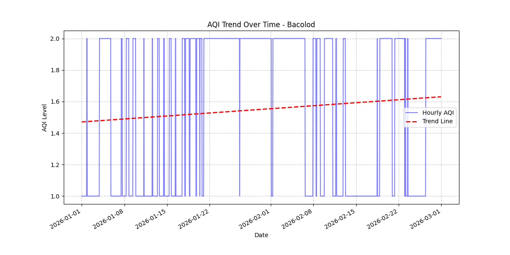
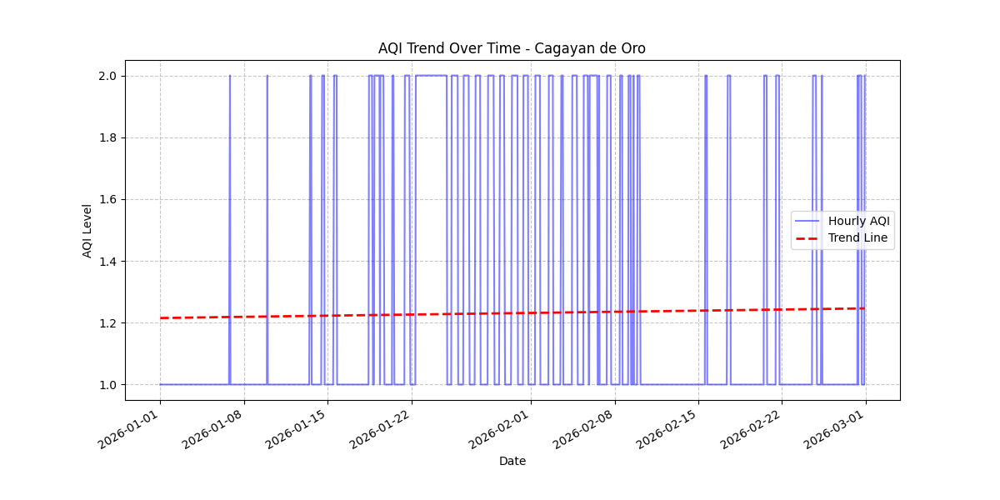
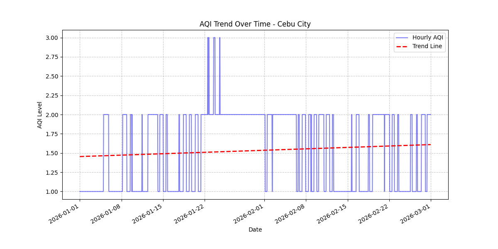
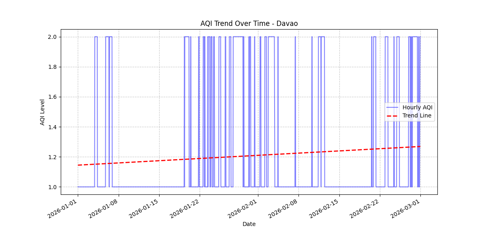
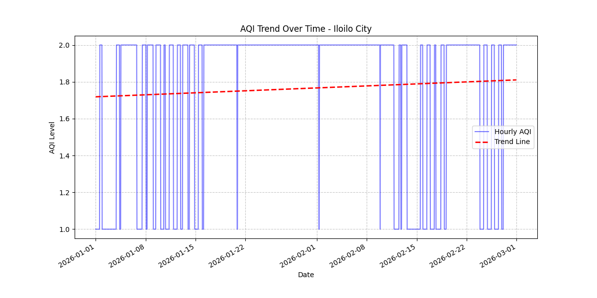
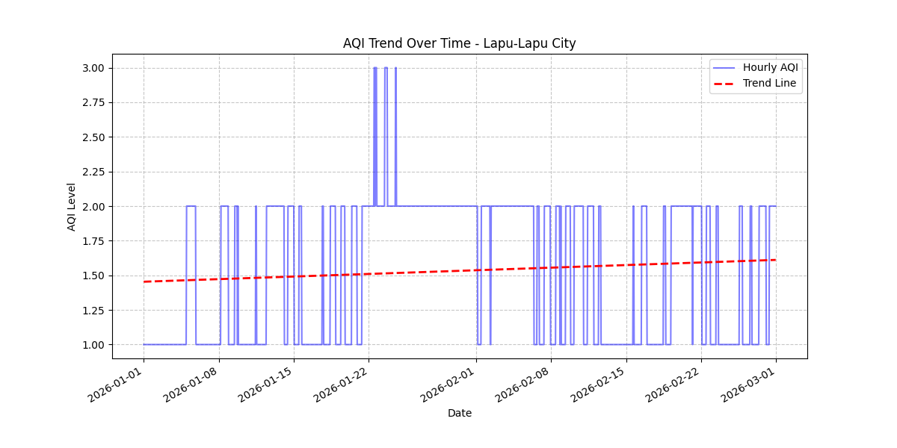
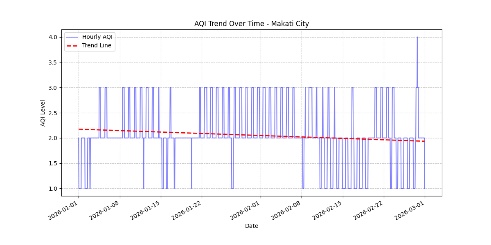
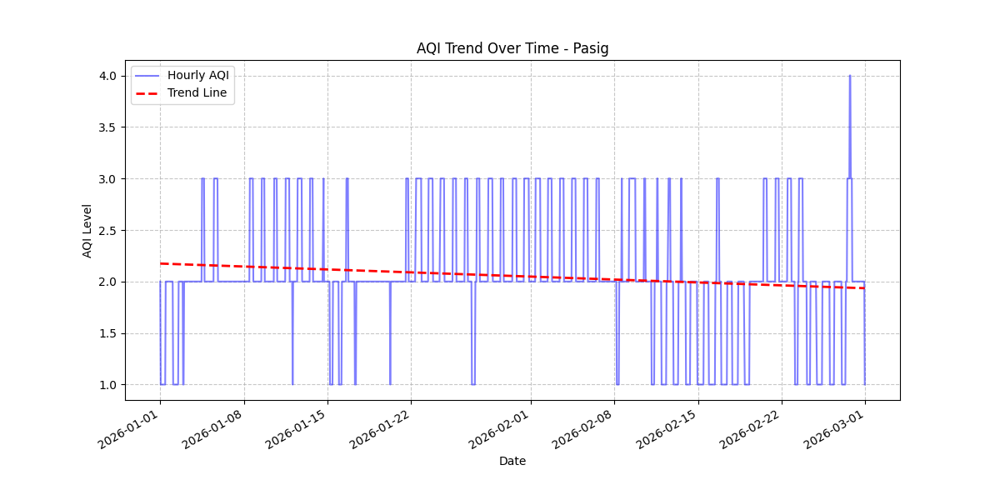
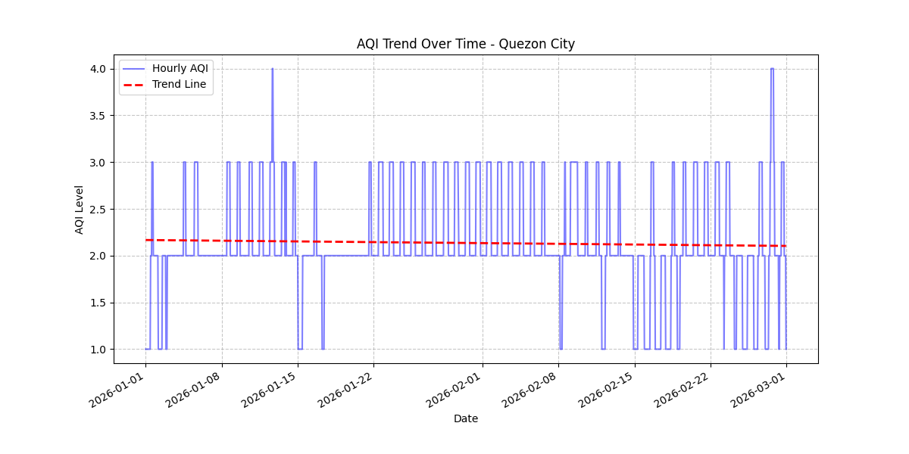

# AQI Trends and Feature Analysis

This document provides proof of AQI trends across selected Philippine cities and analyzes the features that influence the Air Quality Index.

## 1. AQI Trend Analysis (Per City)
For each selected city, a trend line was fitted to the hourly AQI data using a linear regression model. This helps visualize whether air quality is improving, degrading, or remaining stable over the observation period.

### City Trend Plots
The following plots illustrate the hourly AQI levels (blue) and the calculated trend line (red dashed line):

*   **Bacolod**: 
*   **Cagayan de Oro**: 
*   **Cebu City**: 
*   **Davao**: 
*   **Iloilo City**: 
*   **Lapu-Lapu City**: 
*   **Makati City**: 
*   **Manila**: 
*   **Pasig**: 
*   **Quezon City**: 

## 2. Features Affecting AQI
To understand what pollutants most significantly affect the `main.aqi`, we performed a Pearson correlation analysis.

### Pollutant Correlation with AQI
The table below shows how strongly each component correlates with the final AQI value. A value closer to 1.0 indicates a strong positive relationship.

| Pollutant | Correlation with main.aqi |
| :--- | :--- |
| **Ozone (O3)** | **0.8430** |
| **PM10** | **0.5453** |
| **Sulfur Dioxide (SO2)** | **0.5147** |
| **PM2.5** | **0.4683** |
| Carbon Monoxide (CO) | 0.1351 |
| Nitrogen Monoxide (NO) | 0.0821 |
| Nitrogen Dioxide (NO2) | -0.0294 |
| Ammonia (NH3) | -0.1284 |

### Key Insights:
1.  **Ozone (O3)** is the primary driver of AQI levels in this dataset, showing an extremely strong correlation (0.84).
2.  **Particulate Matter (PM10 and PM2.5)** and **Sulfur Dioxide (SO2)** also play significant roles in determining air quality.
3.  **Nitrogen-based pollutants (NO, NO2)** and **Ammonia (NH3)** show minimal or slightly negative correlation with the aggregate AQI, suggesting they are secondary factors in the current regional observations.
