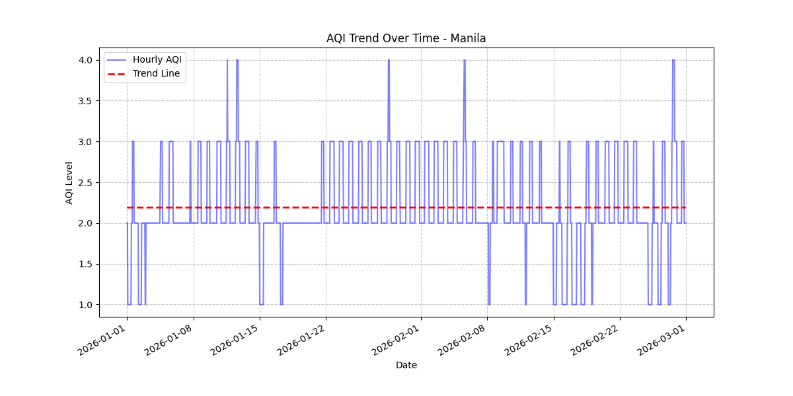
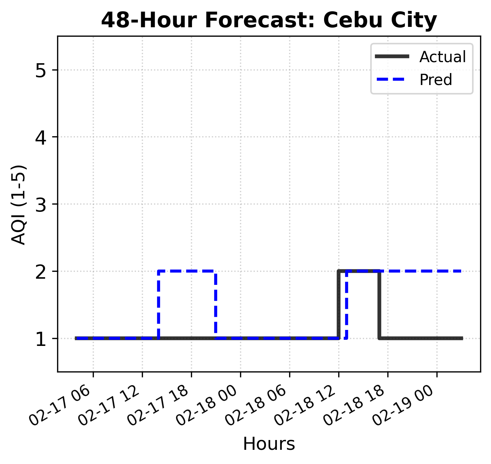

# Predictive Modeling of Hourly Air Quality Index in Selected Philippine Cities Using Multivariate Time Series Forecasting

## Authors and Affiliations

**Rainer Astodillo**, *Bachelor of Science in Information System*  
Carlos Hilado Memorial State University, EB Magalona, Negros Occidental  
rainerastodillo.chmsu@email.com

**Francis Jude Dojoles**, *Bachelor of Science in Information System*  
Carlos Hilado Memorial State University, Silay City, Negros Occidental  
francisdojoles.chmsu@email.com

**Tristan Castillon**, *Bachelor of Science in Information System*  
Carlos Hilado Memorial State University, Talisay City, Negros Occidental  
tristancastillon.chmsu@email.com

**Jeremy Tabag**, *Bachelor of Science in Information System*  
Carlos Hilado Memorial State University, Silay City, Negros Occidental  
jeremytabag.chmsu@email.com

**Katrina Grace Vinas**, *Bachelor of Science in Information System*  
Carlos Hilado Memorial State University, Silay City, Negros Occidental  
kapvinas.chmsu@email.com

## Abstract

Air pollution forecasting is an important decision-support task for urban public health, transportation management, and environmental monitoring. This study developed a city-first time series forecasting pipeline for hourly Air Quality Index (AQI) prediction across ten selected highly urbanized Philippine cities from January to February 2026. Each city was treated as an independent or semi-independent urban air system to reflect localized emission dynamics, population concentration, and urban activity patterns. Missing hourly observations were reconstructed through city-level time interpolation, and models were trained independently for each city to avoid spatial leakage. Five forecasting approaches were evaluated: Naive forecasting, ARIMA, SARIMA with a 24-hour seasonal period, Holt-Winters exponential smoothing, and Long Short-Term Memory (LSTM). Model performance was measured per city using Mean Forecast Error (MFE), Mean Absolute Error (MAE), Mean Squared Error (MSE), Root Mean Squared Error (RMSE), and Mean Absolute Percentage Error (MAPE), then aggregated only for regional interpretation across Luzon, Visayas, and Mindanao. Results showed that LSTM achieved the best overall performance, with average MAE of 0.2904, RMSE of 0.3823, and MAPE of 21.6891% across the ten cities. These findings support the use of city-localized forecasting pipelines for short-term AQI prediction in urban Philippine settings.

## Keywords

Air Quality Index, AQI Forecasting, Time Series Forecasting, LSTM, SARIMA, Urban Air Quality, Philippine Cities.

## I. Introduction

Air pollution remains a persistent concern in rapidly urbanizing environments, where transportation activity, industrial operations, population density, and meteorological conditions interact to influence local air quality. In the Philippines, major urban centers experience distinct pollution patterns depending on traffic intensity, land use, coastal or inland exposure, and surrounding regional climate conditions. The Air Quality Index (AQI) provides a simplified public-facing indicator of air quality by summarizing pollutant concentrations into categorical health-risk levels.

Short-term AQI forecasting can help local government units, environmental agencies, and public health offices issue early advisories and prepare mitigation responses. However, AQI behavior is not uniform across cities. A single national model can obscure local emission profiles and may introduce spatial leakage when observations from one urban system influence predictions for another. For this reason, this study uses a city-first modeling design: each city is treated as an independent or semi-independent urban air system, and regional grouping is used only after evaluation for interpretation.

Previous studies have shown that statistical models, machine learning models, and deep learning architectures can be used for air quality forecasting, with recurrent neural networks such as LSTM being widely applied to sequential AQI and pollutant prediction tasks [7], [8]. Recent work has also explored spatial and hybrid deep learning frameworks for urban AQI prediction [9]. However, many forecasting workflows emphasize global or spatially pooled learning. This study addresses a more localized methodological gap by evaluating independent city-level pipelines for selected Philippine cities, thereby preserving local temporal behavior and reducing cross-city leakage risk.

The main research problem addressed in this study is: **Can city-level multivariate time series models accurately forecast hourly AQI across selected Philippine cities while avoiding spatial leakage between urban systems?**

This study aims to: (1) preprocess and reconstruct hourly AQI records at the city level; (2) engineer time series features without mixing information across cities; (3) train separate forecasting models for each city; and (4) compare model performance per city and by regional aggregation.

## II. Methodology

### A. Research Design

This study employed a quantitative predictive modeling design using city-level time series forecasting. Modeling was performed at the city level to reflect Highly Urbanized City (HUC) independence, where each urban area exhibits distinct emission dynamics driven by localized population density, transportation activity, and industrial structure. Regional grouping into Luzon, Visayas, and Mindanao was used solely for result aggregation and comparative analysis, not for model training.

This design prevents observations from one city from influencing the training sequence of another city. It also improves interpretability because each model's performance can be traced directly to the local behavior of a specific urban air system.

### B. Dataset Information

The dataset was sourced from the Kaggle dataset *Philippine Cities Air Quality Index Data 2026* by bwandowando [6]. It contained hourly AQI and pollutant observations for January to February 2026. The selected city set consisted of ten Philippine urban centers: Manila, Quezon City, Makati City, Pasig, Cebu City, Lapu-Lapu City, Iloilo City, Bacolod, Davao, and Cagayan de Oro.

The ten cities were selected because they represent major urban systems with high population concentration, transportation activity, and regional coverage across Luzon, Visayas, and Mindanao. The selection also reflects dataset availability, since only cities with sufficient hourly observations could support city-level forecasting. This city selection logic strengthens external validity while preserving the independence of each urban time series.

| Table I. Dataset Variables and Model Roles |
| --- |

| Variable | Description | Role |
| --- | --- | --- |
| `datetime` | Hourly timestamp | Temporal index |
| `city_name` | City label | Grouping variable |
| `main.aqi` | Air Quality Index category | Target variable |
| `components.co` | Carbon monoxide concentration | Predictor |
| `components.no` | Nitric oxide concentration | Predictor |
| `components.no2` | Nitrogen dioxide concentration | Predictor |
| `components.o3` | Ozone concentration | Predictor |
| `components.so2` | Sulfur dioxide concentration | Predictor |
| `components.pm2_5` | Fine particulate matter | Predictor |
| `components.pm10` | Coarse particulate matter | Predictor |
| `components.nh3` | Ammonia concentration | Predictor |

The dataset contained `13,863` selected raw city observations before imputation. After city-level hourly completion, the final imputed dataset contained `14,159` observations.

| Table II. City-Level Preprocessing Summary |
| --- |

| Dataset Stage | Rows |
| --- | ---: |
| Selected raw rows | 13,863 |
| Imputed hourly rows | 14,159 |
| Inserted hourly rows | 296 |
| Cities ready for forecasting | 10 |

### C. Data Preprocessing

For each city, records were sorted chronologically by timestamp. Missing hourly observations were reconstructed by creating a complete hourly index from the first to the last available timestamp per city. Pollutant variables were imputed using time-based linear interpolation followed by forward and backward filling at the edges. AQI values were interpolated over time, rounded to the nearest integer, and clipped to the valid AQI category range.

This city-level preprocessing strategy ensured that missing data from one city was never imputed using observations from another city.

### D. Feature Engineering

Feature engineering was performed per city. The engineered variables included AQI lag features `AQI(t-1)`, `AQI(t-2)`, and `AQI(t-24)`; pollutant lag features for CO, NO, NO2, O3, SO2, PM2.5, PM10, and NH3; temporal variables such as hour, day of week, weekend indicator, hour sine, and hour cosine; city-specific 24-hour rolling means for AQI, PM2.5, and PM10; and the one-step-ahead target `AQI(t+1)`.

The main engineered dataset contained `13,909` rows after removing rows without sufficient lag or rolling history.

### E. Forecasting Models

Five forecasting models were trained independently for each city:

1. **Naive Forecasting**: uses the most recent observed AQI value as the forecast.
2. **ARIMA**: uses an autoregressive integrated moving average formulation with order `(1,1,1)`.
3. **SARIMA**: extends ARIMA with seasonal order `(1,1,1,24)` to represent the 24-hour cycle.
4. **Holt-Winters**: applies exponential smoothing with additive trend.
5. **LSTM**: uses a multivariate sequence model.

The LSTM architecture was:

```text
Input: 24-hour city-specific multivariate sequence
LSTM(64)
Dropout(0.2)
LSTM(32)
Dense(1)
Loss: MSE
Output: AQI(t+1)
```

For LSTM only, Min-Max scaling was applied within each city training sequence.

| Table III. Model Configuration Summary |
| --- |

| Model | Configuration | Training Scope |
| --- | --- | --- |
| Naive | Last observed AQI used as forecast | Per city |
| ARIMA | Order `(1,1,1)` | Per city |
| SARIMA | Order `(1,1,1)` and seasonal order `(1,1,1,24)` | Per city |
| Holt-Winters | Additive trend exponential smoothing | Per city |
| LSTM | 24-hour multivariate sequence; LSTM(64), Dropout(0.2), LSTM(32), Dense(1); MSE loss | Per city |

### F. Validation Strategy

Each city was split chronologically using an 80/20 train-test partition. No random split was used. The first 80% of each city's observations were used for training, and the final 20% were used for testing. Evaluation metrics were computed per city:

$$
\text{MAE} = \frac{1}{N}\sum_{i=1}^{N}|y_i-\hat{y_i}|
$$

$$
\text{RMSE} = \sqrt{\frac{1}{N}\sum_{i=1}^{N}(y_i-\hat{y_i})^2}
$$

$$
\text{MAPE} = \frac{1}{N}\sum_{i=1}^{N}\left|\frac{y_i-\hat{y_i}}{y_i}\right|\times100
$$

Overall model scores were computed as the average of city-level metrics. This is consistent with the city-first design because each city contributes as an evaluation unit instead of allowing cities with more rows to dominate the aggregate score.

## III. Results and Discussion

### A. Correlation Analysis

Hourly AQI patterns varied by city, supporting the decision to model cities independently. Fig. 1 shows an example trend visualization for Manila, while Fig. 2 presents the pollutant correlation heatmap used to inspect relationships among AQI and component pollutants.



*Fig. 1. Hourly AQI trend for Manila.*


*Fig. 2. Component correlation heatmap for AQI and pollutant variables.*

The feature analysis identified ozone (O3), PM10, SO2, and PM2.5 as the strongest positive correlates of AQI in the processed dataset. These pollutants are consistent with expected urban air quality drivers, including photochemical reactions, road dust, fuel combustion, and particulate emissions.

| Table IV. Pearson Correlation Between Pollutants and AQI |
| --- |

| Pollutant | Correlation with AQI |
| --- | ---: |
| O3 | 0.8430 |
| PM10 | 0.5453 |
| SO2 | 0.5147 |
| PM2.5 | 0.4683 |
| CO | 0.1351 |
| NO | 0.0821 |
| NO2 | -0.0294 |
| NH3 | -0.1284 |

### B. Model Performance

Table V reports the city-averaged forecasting results across all ten cities. LSTM achieved the lowest error across MAE, MSE, RMSE, and MAPE.

| Table V. Overall City-Averaged Model Performance |
| --- |

| Model | MFE | MAE | MSE | RMSE | MAPE (%) | Cities Evaluated |
| --- | ---: | ---: | ---: | ---: | ---: | ---: |
| LSTM | -0.0978 | 0.2904 | 0.1477 | 0.3823 | 21.6891 | 10 |
| SARIMA | 0.3570 | 0.4881 | 0.3874 | 0.6057 | 26.4831 | 10 |
| ARIMA | 0.4107 | 0.5762 | 0.5958 | 0.7072 | 30.4305 | 10 |
| Naive | 0.6529 | 0.6529 | 0.8324 | 0.8591 | 29.7824 | 10 |
| Holt-Winters | 0.6897 | 0.6897 | 0.9140 | 0.8922 | 31.8580 | 10 |


*Fig. 3. Comparison of MAE and RMSE across forecasting models.*

The LSTM model's advantage suggests that multivariate sequence learning captured nonlinear relationships between pollutant levels and short-term AQI transitions more effectively than linear and smoothing-based approaches. SARIMA ranked second overall, indicating that the 24-hour seasonal structure is meaningful in the dataset.

Regional aggregation was performed only after city-level evaluation. LSTM achieved the lowest RMSE in Luzon (`0.4000`), Mindanao (`0.3459`), and Visayas (`0.3828`). Table VI summarizes the best model per region.

| Table VI. Regional Aggregation of Forecasting Metrics |
| --- |

| Island Group | Best Model by RMSE | Best RMSE | Best MAE | Best MAPE (%) |
| --- | --- | ---: | ---: | ---: |
| Luzon | LSTM | 0.4000 | 0.3198 | 21.6600 |
| Mindanao | LSTM | 0.3459 | 0.2266 | 18.0446 |
| Visayas | LSTM | 0.3828 | 0.2930 | 23.5404 |

Table VII presents the per-city RMSE values for all forecasting models. LSTM was the best-performing model for all ten cities in the latest run.

| Table VII. Per-City Model Performance by RMSE |
| --- |

| City | Island Group | Naive | ARIMA | SARIMA | Holt-Winters | LSTM | Best Model |
| --- | --- | ---: | ---: | ---: | ---: | ---: | --- |
| Bacolod | Visayas | 0.7340 | 0.7066 | 0.7923 | 0.7340 | 0.3723 | LSTM |
| Cagayan de Oro | Mindanao | 0.3712 | 0.3520 | 0.3321 | 0.3712 | 0.2932 | LSTM |
| Cebu City | Visayas | 0.6740 | 0.5363 | 0.4713 | 0.6740 | 0.4449 | LSTM |
| Davao | Mindanao | 0.5035 | 0.4704 | 0.5075 | 0.5035 | 0.3987 | LSTM |
| Iloilo City | Visayas | 0.8496 | 0.5694 | 0.6247 | 0.8497 | 0.3480 | LSTM |
| Lapu-Lapu City | Visayas | 0.6740 | 0.5363 | 0.4713 | 0.6740 | 0.3660 | LSTM |
| Makati City | Luzon | 1.0974 | 0.6554 | 0.6984 | 1.2053 | 0.4004 | LSTM |
| Manila | Luzon | 1.3215 | 1.3215 | 0.6991 | 1.4378 | 0.3792 | LSTM |
| Pasig | Luzon | 1.0990 | 0.6573 | 0.6988 | 1.2057 | 0.3978 | LSTM |
| Quezon City | Luzon | 1.2671 | 1.2671 | 0.7611 | 1.2671 | 0.4225 | LSTM |

Fig. 4 shows a 48-hour sample forecast for Cebu City using LSTM, the best-performing model in the city-averaged evaluation.



*Fig. 4. Cebu City 48-hour AQI forecast sample using LSTM.*

Fig. 5 presents the LSTM training curve generated from the city-aware LSTM configuration. The curve provides a visual check of convergence behavior during model fitting.


*Fig. 5. LSTM training and validation loss curve.*

### C. Policy Implications

The city-first results suggest that local government units should treat AQI forecasting as a city-specific planning task rather than relying only on a national or regional average. Since LSTM performed best across all cities, local monitoring systems may benefit from multivariate sequence models that incorporate recent pollutant history and time-of-day behavior.

SARIMA remains valuable for cities or time windows with clear 24-hour cycles because it is easier to interpret than LSTM. This makes it useful for communicating diurnal pollution trends to decision-makers. Forecast outputs may support public advisories, traffic management, school activity planning, and targeted monitoring during expected high-AQI periods.

## IV. Conclusion

This study implemented a city-first AQI forecasting pipeline for ten selected Philippine cities using hourly observations from January to February 2026. The pipeline explicitly avoided global cross-city training by sorting, imputing, scaling, feature engineering, training, and evaluating at the city level. Regional groupings were used only as a secondary analysis layer.

The latest evaluation showed that LSTM produced the strongest overall forecasting performance, with city-averaged MAE of 0.2904, RMSE of 0.3823, and MAPE of 21.6891%. SARIMA ranked second, supporting the presence of 24-hour seasonal behavior in the AQI series. The results demonstrate that city-localized multivariate sequence modeling is a defensible and effective approach for short-term AQI prediction in selected highly urbanized Philippine settings.

The study has several limitations. First, the dataset covers only January to February 2026, so longer seasonal patterns across dry and wet periods were not evaluated. Second, the dataset did not include meteorological predictors such as temperature, humidity, rainfall, wind speed, and wind direction, which may influence pollutant dispersion. Third, AQI is an ordinal category, so regression-style errors should be interpreted as deviations in AQI category scale rather than direct pollutant concentration errors. Finally, LSTM training may produce slight variation between runs because neural network optimization is stochastic.

Future work may extend the observation period beyond two months, incorporate meteorological variables such as temperature, humidity, wind speed, and rainfall, and compare the city-first approach against a carefully controlled global model with city encoding.

## References

[1] G. E. Box, G. M. Jenkins, G. C. Reinsel, and G. M. Ljung, *Time Series Analysis: Forecasting and Control*, 5th ed. Hoboken, NJ, USA: Wiley, 2015.

[2] C. C. Holt, "Forecasting seasonals and trends by exponentially weighted moving averages," *International Journal of Forecasting*, vol. 20, no. 1, pp. 5-10, 2004.

[3] P. R. Winters, "Forecasting sales by exponentially weighted moving averages," *Management Science*, vol. 6, no. 3, pp. 324-342, 1960.

[4] S. Hochreiter and J. Schmidhuber, "Long short-term memory," *Neural Computation*, vol. 9, no. 8, pp. 1735-1780, 1997.

[5] World Health Organization, *WHO Global Air Quality Guidelines: Particulate Matter (PM2.5 and PM10), Ozone, Nitrogen Dioxide, Sulfur Dioxide and Carbon Monoxide*. Geneva, Switzerland: WHO, 2021.

[6] bwandowando, "Philippine Cities Air Quality Index Data 2026," Kaggle. [Online]. Available: https://www.kaggle.com/datasets/bwandowando/philippine-cities-air-quality-index-data-2026/

[7] H. Wu, T. Yang, H. Wu, H. Li, and Z. Zhou, "Air quality prediction based on Long Short-Term Memory Model with advanced feature selection and hyperparameter optimization," *Journal of Intelligent & Fuzzy Systems*, 2023.

[8] S. Kumar and M. P. Singh, "Data-driven real-time short-term prediction of air quality: Comparison of ES, ARIMA, and LSTM," arXiv:2211.09814, 2022.

[9] M. S. Alam et al., "Enhancing urban air quality prediction using time-based-spatial forecasting framework," *Scientific Reports*, 2024.
