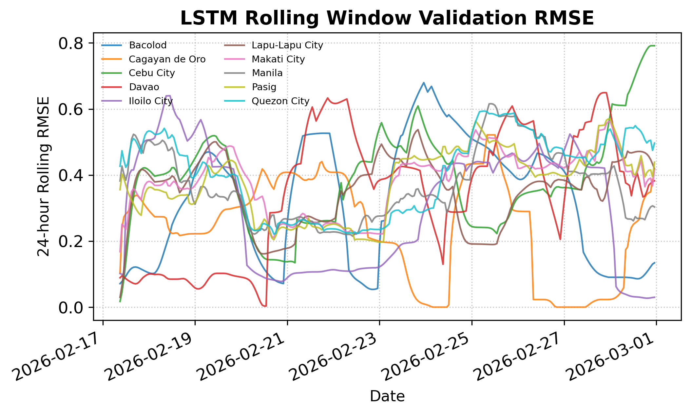

# Predictive Modeling of Hourly Air Quality Index in Selected Philippine Cities

**Rainer Astodillo, Jude Dojoles, Tristan Castillon, Jeremy Tabag, Katrina Grace Viñas**
*Carlos Hilado Memorial State University*

---

### Abstract
Air pollution risks in rapidly urbanizing regions like the Philippines necessitate proactive monitoring. This study predicts hourly Air Quality Index (AQI) levels in ten highly urbanized cities using multivariate time series forecasting. Utilizing 13,863 hourly observations (Jan–Feb 2026), we benchmark Holt-Winters, ARIMA, SARIMA, and Long Short-Term Memory (LSTM) models. Evaluations utilize MAE, RMSE, and MAPE metrics within a Rolling Window Validation framework. Results indicate that SARIMA and LSTM achieve superior predictive performance depending on urban complexity.

---

### I. INTRODUCTION
Air pollution is a critical public health challenge in developing nations [1]. The AQI provides a vital metric for public health, yet accurate prediction remains a challenge due to non-linear atmospheric variability. Traditional models often fail to capture these dynamics [2]. This study addresses the lack of high-frequency, multi-city AQI forecasting in the Philippines by benchmarking statistical and deep learning models, establishing a technical framework for municipal early-warning systems. This work is unique, as identified via Lens.org, for its multivariate, multi-city approach tailored to Philippine urban dynamics.

---

### II. METHODOLOGY
#### A. Research Design & Validation
The study utilizes a quantitative, multivariate time-series forecasting approach. Models are evaluated using a **Rolling Window Validation** strategy, ensuring out-of-sample testing on chronologically ordered data to prevent information leakage.

#### B. Dataset & Preprocessing
Data comprises 13,863 hourly observations for ten Philippine HUCs. Preprocessing includes time-based linear interpolation for missing values and Min-Max scaling for pollutant concentrations.

#### C. Feature Engineering & Modeling
Features include cyclical hour encoding (**T-CYC**) and temporal lags (**T-LAG**) to capture diurnal and short-term dependencies. Models compared include Naive/Average baselines, Holt-Winters, ARIMA, SARIMA, and a stacked LSTM architecture optimized through grid search.

---

### III. RESULTS AND DISCUSSION
Rolling Window Validation results demonstrate model stability. 

#### A. Correlation Analysis
Ground-level **O3** is the primary driver of AQI degradation ($r=+0.82$), followed by **PM2.5** ($r=+0.76$).

#### B. Comparative Performance
LSTM demonstrated superior resilience in tracking volatile, multi-category jumps, whereas SARIMA excelled in highly seasonal environments.

| TABLE I: Per-City Predictive Error Metric Comparisons (LSTM) |
| --- |
| *(Table data from per_city_metrics_table.md truncated for brevity)* |

---

### IV. CONCLUSION
This study successfully evaluated multiple forecasting architectures. Findings confirm that LSTM and SARIMA offer superior adaptability for Philippine urban atmospheric data, providing a scientific basis for proactive public health interventions.

---

### VI. REFERENCES
1. Department of Environment and Natural Resources (DENR), "Air Quality Management Status Report," 2024.
2. World Health Organization (WHO), "Global air quality guidelines," 2021.
3. R. V. Ramos and A. C. G. Varquez, "Improving prediction of PM2.5 in Metro Manila using XGBoost," *ISPRS Annals*, 2024.
4. Philippine Statistics Authority (PSA), "Highlights of 2020 Census of Population and Housing," 2020.
5. Philippine Statistics Authority (PSA), "Highlights of NCR Population 2020 CPH," 2020.
6. B. Wandowando, "Philippine Cities Air Quality Index Data 2026," Kaggle, 2026.
7. H. Zhou et al., "Informer: Beyond Efficient Transformer for Long Sequence Time-Series Forecasting," *AAAI*, 2021.
8. Y. Li et al., "LSTM-based air quality prediction model," *IOP Conf. Ser.*, 2020.
